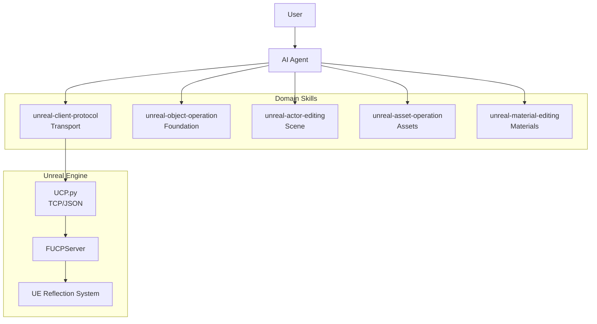
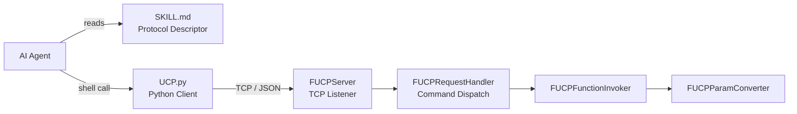
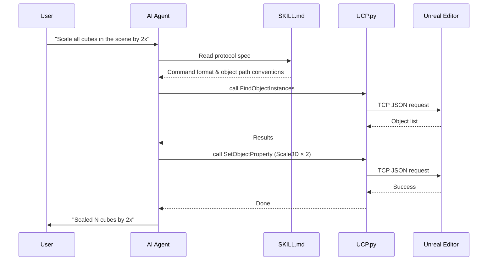

<p align="center">
  <h1 align="center">UnrealClientProtocol</h1>
  <p align="center">
    <strong>Give your AI Agent a pair of hands that reach into Unreal Engine.</strong>
  </p>
  <p align="center">
    <a href="LICENSE"></a>
    <a href="https://www.unrealengine.com/"></a>
    <a href="https://www.python.org/"></a>
    <a href="#3-install-agent-skills"></a>
    <a href="README_CN.md"></a>
  </p>
</p>

---

UnrealClientProtocol (UCP) is an atomic client communication protocol designed for AI Agents. Its core design philosophy is:

- **Don't make decisions for the Agent — give it capability.**

Traditional UE automation requires writing dedicated interfaces or scripts for every operation. UCP takes the opposite approach — it exposes only the engine's atomic capabilities (call any UFunction, read/write any UPROPERTY, find objects, introspect metadata), then trusts the AI Agent's own understanding of the Unreal Engine API to compose these primitives into arbitrarily complex tasks.

This means:

- **You don't need to predefine "what it can do."** The Agent isn't limited to a fixed set of predefined commands — it has access to every function and property exposed by the engine's reflection system. If the engine can do it, the Agent can do it.
- **You can shape Agent behavior with Skills.** By authoring custom Skill files, you can inject domain knowledge into specific workflows — level design conventions, asset naming rules, material authoring strategies — and the Agent will combine this knowledge with the UCP protocol to work the way you define.
- **Capabilities grow as models evolve.** The UCP protocol layer is stable, while AI comprehension is continuously improving. Today the Agent might need `describe` to explore an unfamiliar class; tomorrow it may already know it by heart. You don't need to change a single line of code to benefit from AI progress.

## Why AI Agent + Atomic Protocol + Domain Skills Changes Everything

### LLMs Already Understand Unreal Engine

Ask any large language model — even one not specialized for coding — "How do you get all Actors in UE via Blueprint? What's the function signature?" Most LLMs can answer accurately: `UGameplayStatics::GetAllActorsOfClass`, parameters are `WorldContextObject` and `ActorClass`, returns `TArray<AActor*>`.

This demonstrates that **LLMs already possess deep knowledge of Unreal Engine.** They understand the reflection system, know the APIs of common modules, and can map Blueprint nodes to their underlying C++ functions. This knowledge isn't exclusive to any particular model — it's a consensus across the entire LLM ecosystem.

But knowledge alone isn't capability. The "balanced" nature of LLMs means they tend toward generic, conservative responses without guidance — they know how to do it, but won't proactively act. What UCP does is simple: **give them hands (the protocol) plus a behavioral framework (Skills), turning existing knowledge into actual action.**

### From ShaderToy to Production Materials — Skill-Driven Continuous Evolution

Take material authoring as an example. UCP's current material Skill can read and write complete material node graphs, meaning the Agent is fully capable of translating ShaderToy code into corresponding UE materials — decomposing logic, building nodes, wiring pins, compiling and verifying, all in one seamless flow.

But the distance from a demo-level effect to a production-grade engineered material isn't about protocol capability — it's about **domain experience**:

- **Workflow experience**: Repeated logic should be abstracted into Material Functions; prefer a single parent material covering more variants over creating separate materials for each effect.
- **Craft experience**: Scene, character, VFX, and UI each have different material strategies; classic techniques (FlowMap, parallax mapping, distance field blending) have proven node composition patterns.
- **Self-feedback loops**: The Agent should be able to validate its own output — compile the material, check instruction count, compare against expected results — then distill successful experiences into new Skill knowledge.

This is the evolutionary direction of Skills: **not a one-time instruction manual, but a continuously accumulating, ever-refining experience base.** Every successful material creation can feed back into more precise Skill descriptions, making the Agent better next time.

### Skill Memory Layering — A Sustainably Evolving Architecture

The Agent community is adopting a memory layer strategy called "Skills" or "Memory" that dramatically improves AI performance in specific domains by structuring experience into retrievable knowledge fragments.

For Unreal Engine, this strategy has a natural fit. UE itself is highly modular — rendering, physics, animation, UI, networking, audio — each subsystem has independent API hierarchies and best practices. This means Skill layering can naturally align with UE's module structure:

```
Skills/
├── unreal-client-protocol/     # Transport: protocol spec, invocation patterns
├── unreal-object-operation/    # Foundation: property R/W, object search, metadata
├── unreal-actor-editing/       # Scene: Actor lifecycle management
├── unreal-asset-operation/     # Assets: search, dependencies, CRUD
├── unreal-material-editing/    # Materials: node graphs, HLSL, material instances
├── unreal-animation/           # (future) Animation layer
├── unreal-blueprint/           # (future) Blueprint layer
└── ...
```

As functionality grows, the Skill system will become increasingly extensive. But this isn't a problem — based on UE's own code structure and LLMs' understanding of UE modules, Skill memory layering can be systematically constructed. When executing tasks, the Agent only loads the relevant Skill subset rather than reading all knowledge at once.

More importantly, **this is an open, community-collaborative architecture.** Any developer can write Skills for their workflow — a Technical Artist can contribute material authoring experience, a Level Designer can contribute scene building conventions, a Tools Programmer can contribute engine extension patterns — and this knowledge ultimately flows into a shared Skill ecosystem that benefits everyone.

## Features

- **Zero Intrusion** — Pure plugin architecture; drop into `Plugins/` and go, no engine source changes required
- **Reflection-Driven** — Leverages UE's native reflection system to automatically discover all `UFunction` and `UPROPERTY` fields
- **Minimal Protocol** — Only `call` + `batch` commands, covering every reflectable operation in the engine
- **Batch Execution** — Send multiple commands in a single request to minimize round-trips
- **Editor Integration** — Property writes are automatically registered with the Undo/Redo system
- **WorldContext Auto-Injection** — No need to manually pass WorldContext parameters
- **Security Controls** — Loopback-only binding, class path allowlists, and function blocklists
- **Batteries-Included Python Client** — Lightweight CLI script to talk to the engine in one line
- **Domain Skill Ecosystem** — 5 specialized Skills covering objects, Actors, assets, and materials; Agent loads domain knowledge on demand
- **Multi-Tool Compatible** — Skill descriptors work with Cursor / Claude Code / OpenCode and other mainstream AI coding tools

## Skill Ecosystem

The UCP protocol layer provides "atomic capabilities" — calling functions, reading/writing properties. **Domain Skills** organize these atomic capabilities into domain-specific work patterns, letting the Agent load the right expertise for each task scenario.

Currently available Skills:

| Skill | Layer | Capabilities |
|-------|-------|-------------|
| `unreal-client-protocol` | Transport | TCP/JSON communication, `call` / `batch` protocol, error handling & self-correction |
| `unreal-object-operation` | Foundation | Any UObject property R/W, metadata introspection, instance search, derived class discovery, Undo/Redo |
| `unreal-actor-editing` | Scene | Actor spawn / delete / duplicate / move / select, level queries, viewport control |
| `unreal-asset-operation` | Assets | AssetRegistry search, dependency & reference analysis, asset CRUD, editor operations |
| `unreal-material-editing` | Materials | Text-based material node graph R/W, Custom HLSL, material instance editing, compilation & stats |

Each Skill is a standalone SKILL.md file that the Agent reads on demand when receiving a task. Skills naturally chain through the UCP protocol layer — for example, creating a material requires `unreal-asset-operation`'s asset creation + `unreal-material-editing`'s node graph editing + `unreal-object-operation`'s property setting; the Agent automatically combines multiple Skills to complete composite tasks.

## How It Works

### Architecture Overview



### Transport Layer Detail



## Quick Start

### 1. Install the Plugin

Copy the `UnrealClientProtocol` folder into your project's `Plugins/` directory and restart the editor to compile.

### 2. Verify the Connection

Once the editor starts, the plugin automatically listens on `127.0.0.1:9876`. Test it with the bundled Python client:

```bash
python Plugins/UnrealClientProtocol/Skills/unreal-client-protocol/scripts/UCP.py '{"type":"call","object":"/Script/UnrealClientProtocol.Default__ObjectOperationLibrary","function":"FindObjectInstances","params":{"ClassName":"/Script/Engine.World","Limit":3}}'
```

If you see a list of World objects, you're all set.

### 3. Install Agent Skills

The plugin ships with a complete Skill suite under [`Skills/`](./Skills/). You can copy them manually, or simply ask the Agent to do it for you.

**Option A: Let the Agent install (recommended)**

Send this instruction to your Agent:

> "Copy all Skill folders from `Plugins/UnrealClientProtocol/Skills/` to the project's `.cursor/skills/` directory and make sure the scripts work"

The Agent will handle the file copying automatically.

**Option B: Manual copy**

Copy **all folders** from `Skills/` into your AI tool's Skills directory:

| Tool | Target Path |
|------|-------------|
| **Cursor** | `.cursor/skills/` |
| **Claude Code** | `.claude/skills/` |
| **OpenCode** | `.opencode/skills/` |
| **Other** | Follow your tool's Agent Skills convention |

The resulting directory structure:

```
.cursor/skills/                              # or .claude/skills/, etc.
├── unreal-client-protocol/
│   ├── SKILL.md                             # Transport layer protocol descriptor
│   └── scripts/
│       └── UCP.py                           # Python client
├── unreal-object-operation/
│   └── SKILL.md                             # Object operations
├── unreal-actor-editing/
│   └── SKILL.md                             # Actor operations
├── unreal-asset-operation/
│   └── SKILL.md                             # Asset operations
└── unreal-material-editing/
    └── SKILL.md                             # Material operations
```

**Resolving Script Execution Policy Issues (Windows)**

On Windows, PowerShell's default execution policy may prevent the Agent from running Python scripts. If you encounter a "cannot be loaded because running scripts is disabled on this system" error, open PowerShell as **Administrator** and run:

```powershell
Set-ExecutionPolicy RemoteSigned -Scope CurrentUser
```

Or simply ask the Agent to run this command for you.

Once configured, when the Agent receives Unreal Engine-related instructions, it will automatically read the relevant SKILL.md and communicate with the editor via `scripts/UCP.py`.

> **Workflow**: User gives an instruction → Agent identifies and reads SKILL.md → Builds JSON commands per the protocol → Sends via `UCP.py` → Returns results



### 4. Verify Agent Functionality

Send the following test prompts to your Agent to confirm the Skills are configured correctly:

- **Query the scene**: "Show me what's in the current scene"
- **Read a property**: "What real-world time does the current sunlight correspond to?"
- **Modify a property**: "Change the time to 6 PM"
- **Call a function**: "Call GetPlatformUserName to check the current username"
- ...

If the Agent automatically constructs the correct JSON commands, invokes `UCP.py`, and returns results, the setup is complete.

## Configuration

Configure via **Editor → Project Settings → Plugins → UCP**:

| Setting | Type | Default | Description |
|---------|------|---------|-------------|
| `bEnabled` | bool | `true` | Enable or disable the plugin |
| `Port` | int32 | `9876` | TCP listen port (1024–65535) |
| `bLoopbackOnly` | bool | `true` | Bind to 127.0.0.1 only |
| `AllowedClassPrefixes` | TArray\<FString\> | empty | Class path allowlist prefixes; empty = no restriction |
| `BlockedFunctions` | TArray\<FString\> | empty | Function blocklist; supports `ClassName::FunctionName` format |

## Known Limitations

- **Latent functions** (those with `FLatentActionInfo` parameters) are not supported
- **Delegates** cannot be passed as parameters
- Editor builds only

## Roadmap

- [x] Atomic protocol (call / batch / reflection-driven)
- [x] Object operations (property R/W, metadata introspection, instance search, Undo/Redo)
- [x] Material text serialization (node graph R/W, Custom HLSL, material instance editing)
- [x] Actor operations (spawn, delete, duplicate, select, transform)
- [x] Asset management (AssetRegistry search, dependency analysis, CRUD, editor operations)
- [ ] Blueprint text serialization
- [ ] Visual perception (screenshots / preview feedback so the Agent can "see" its own results)
- [ ] Skill memory layering & self-feedback (experience accumulation, output self-validation, continuous knowledge growth)

## License

[MIT License](LICENSE) — Copyright (c) 2025 [Italink](https://github.com/Italink)
