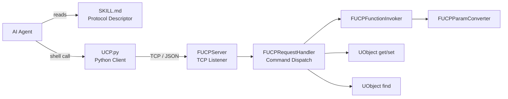

<p align="center">
  <h1 align="center">UnrealClientProtocol</h1>
  <p align="center">
    <strong>Give your AI Agent a pair of hands that reach into Unreal Engine.</strong><br/>
    <a href="README_CN.md">中文文档</a>
  </p>
  <p align="center">
    <a href="LICENSE"></a>
    <a href="https://www.unrealengine.com/"></a>
    <a href="https://www.python.org/"></a>
    <a href="#3-install-agent-skills"></a>
    <a href="README_CN.md"></a>
  </p>
</p>

---

UnrealClientProtocol (UCP) provides an atomic client communication protocol. Its core design philosophy is:

- **Don't make decisions for the Agent — give it capability.**

Traditional UE automation requires writing dedicated interfaces or scripts for every operation. UCP takes the opposite approach — it exposes only the engine's atomic capabilities (call functions, read/write properties, find objects, introspect metadata), then trusts the AI Agent's own understanding of the Unreal Engine API to compose these primitives into complex tasks.

This means:

- **You don't need to predefine "what it can do."** The Agent isn't limited to a fixed set of predefined commands — it has access to every function and property exposed by the engine's reflection system. If the engine can do it, the Agent can do it.
- **You can shape Agent behavior with Skills.** By authoring custom Skill files, you can inject domain knowledge into specific workflows — level design conventions, asset naming rules, material parameter tuning strategies — and the Agent will combine this knowledge with the UCP protocol to work the way you define.
- **Capabilities grow as models evolve.** The UCP protocol layer is stable, while AI comprehension is continuously improving. Today the Agent might need `describe` to explore an unfamiliar class; tomorrow it may already know it by heart. You don't need to change a single line of code to benefit from AI progress.

We believe the combination of AI Agents + atomic protocol + domain Skills will fundamentally change how developers interact with Unreal Engine. UCP is the first step toward that vision.

## Features

- **Zero Intrusion** — Pure plugin architecture; drop into `Plugins/` and go, no engine source changes required
- **Reflection-Driven** — Leverages UE's native reflection system to automatically discover all `UFunction` and `UPROPERTY` fields
- **Atomic Protocol** — 5 command types covering UObject discovery, function invocation, property I/O, and metadata introspection
- **Batch Execution** — Send multiple commands in a single request to minimize round-trips
- **Editor Integration** — `set_property` commands are automatically registered with the Undo/Redo system
- **WorldContext Auto-Injection** — No need to manually pass WorldContext parameters
- **Security Controls** — Loopback-only binding, class path allowlists, and function blocklists
- **Batteries-Included Python Client** — Lightweight CLI script to talk to the engine in one line
- **Agent Skills Integration** — Ships with Skill descriptors (compatible with Cursor / Claude Code / OpenCode, etc.) so AI agents can understand and use the protocol natively

## How It Works



## Quick Start

### 1. Install the Plugin

Copy the `UnrealClientProtocol` folder into your project's `Plugins/` directory and restart the editor to compile.

### 2. Verify the Connection

Once the editor starts, the plugin automatically listens on `127.0.0.1:9876`. Test it with the bundled Python client:

```bash
# Create a temp JSON file, then pass it via -f to avoid shell escaping issues
echo '{"type":"find","class":"/Script/Engine.World","limit":3}' > /tmp/ucp_test.json
python Plugins/UnrealClientProtocol/Skills/unreal-client-protocol/scripts/UCP.py -f /tmp/ucp_test.json
```

On **PowerShell**, use:

```powershell
'{"type":"find","class":"/Script/Engine.World","limit":3}' | Set-Content -Path ucp_test.json -Encoding UTF8
python Plugins\UnrealClientProtocol\Skills\unreal-client-protocol\scripts\UCP.py -f ucp_test.json
```

If you see a list of World objects, you're all set.

### 3. Install Agent Skills

The plugin ships with **4 Skill packages** under [`Skills/`](Skills/):

| Skill | Description |
|-------|-------------|
| `unreal-client-protocol` | Core protocol — UCP commands, `UCP.py` client, invocation guide |
| `unreal-graph-script` | UGS syntax reference for reading/writing graph assets |
| `unreal-blueprint-editor` | Blueprint-specific editing workflow and patterns |
| `unreal-material-editor` | Material-specific reading/editing workflow and patterns |

Copy **all four folders** from `Skills/` into your AI tool's Skills directory:

| Tool | Target Path |
|------|-------------|
| **Cursor** | `<project>/.cursor/skills/` |
| **Claude Code** | `<project>/.claude/skills/` |
| **OpenCode** | `<project>/.opencode/skills/` |
| **Other** | Follow your tool's Agent Skills convention |

The resulting directory structure:

```
<project>/.cursor/skills/               # or .claude/skills/, etc.
├── unreal-client-protocol/
│   ├── SKILL.md                        # Protocol descriptor (auto-read by Agent)
│   └── scripts/
│       └── UCP.py                      # Python client (invoked via Shell by Agent)
├── unreal-graph-script/
│   └── SKILL.md                        # UGS syntax reference
├── unreal-blueprint-editor/
│   └── SKILL.md                        # Blueprint editing guide
└── unreal-material-editor/
    └── SKILL.md                        # Material editing guide
```

> **Important**: The `unreal-client-protocol` folder **must** include the `scripts/` subfolder with `UCP.py`. The SKILL.md instructs the Agent to locate `scripts/UCP.py` relative to itself — if the script is missing, the Agent won't be able to communicate with the engine.

> **Cross-platform note**: The SKILL.md instructs the Agent to always pass JSON via a temporary file (`-f` flag) instead of command-line arguments or stdin pipes. This avoids shell quoting/escaping issues on PowerShell, cmd, and bash.

Once in place, the Agent will automatically read the relevant SKILL.md when it receives Unreal Engine-related instructions and communicate with the editor via `UCP.py`.

> **Workflow**: User gives an instruction → Agent identifies and reads SKILL.md → Builds JSON commands per the protocol → Writes JSON to a temp file → Sends via `UCP.py -f` → Returns results


### 4. Verify Agent Functionality

Send the following test prompts to your Agent to confirm the Skills are configured correctly:

- **Query the scene**: "Show me what's in the current scene"
- **Read a property**: "What real-world time does the current sunlight correspond to?"
- **Modify a property**: "Change the time to 6 PM"
- **Call a function**: "Call GetPlatformUserName to check the current username"
- ...

If the Agent automatically constructs the correct JSON commands, invokes `UCP.py`, and returns results, the setup is complete.

## Configuration

Configure via **Editor → Project Settings → Plugins → UCP**:

| Setting | Type | Default | Description |
|---------|------|---------|-------------|
| `bEnabled` | bool | `true` | Enable or disable the plugin |
| `Port` | int32 | `9876` | TCP listen port (1024–65535) |
| `bLoopbackOnly` | bool | `true` | Bind to 127.0.0.1 only |
| `AllowedClassPrefixes` | TArray\<FString\> | empty | Class path allowlist prefixes; empty = no restriction |
| `BlockedFunctions` | TArray\<FString\> | empty | Function blocklist; supports `ClassName::FunctionName` format |

## Known Limitations

- **Latent functions** (those with `FLatentActionInfo` parameters) are not supported
- **Delegates** cannot be passed as parameters
- Editor builds only

## Roadmap

- [ ] Blueprint text serialization
- [ ] Material text serialization
- [ ] Visual perception

## License

[MIT License](LICENSE) — Copyright (c) 2025 [Italink](https://github.com/Italink)
