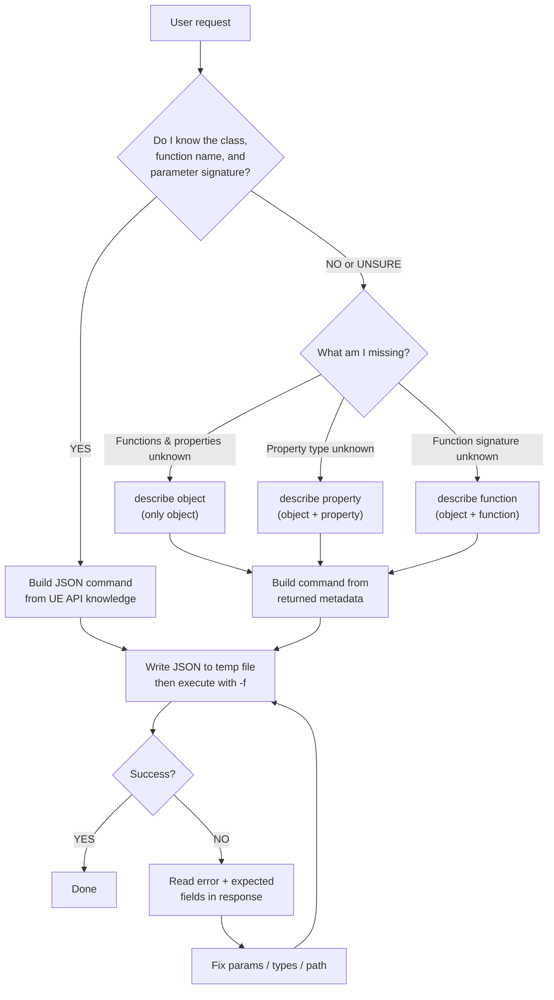

# UnrealClientProtocol

Communicate with a running UE editor through the UnrealClientProtocol TCP plugin.

## Invocation

**Locate `UCP.py`**: The Python client lives at `scripts/UCP.py` **relative to this SKILL.md file**. When you read this file, note its absolute path and resolve `scripts/UCP.py` from the same directory.

**Method 1 — stdin (preferred):** Write JSON to the Shell tool's stdin via pipe:

```bash
echo '{"type":"find","class":"/Script/Engine.Blueprint","limit":20}' | python <path-to-UCP.py>
```

**Method 2 — file (-f):** For very long JSON that may hit shell limits:

```bash
python <path-to-UCP.py> -f <path-to-json-file>
```

**Example — batch (stdin):**

```bash
echo '[{"type":"find","class":"/Script/Engine.StaticMeshActor","limit":50},{"type":"find","class":"/Script/Engine.PointLight","limit":20}]' | python <path-to-UCP.py>
```

**NEVER** pass JSON as a command-line argument or via `echo ... | --stdin`. These approaches break on PowerShell due to double-quote stripping and curly-brace parsing.

## Core Principle — "Knowledge First, Describe to Verify"

You (the AI) already possess extensive knowledge of the Unreal Engine C++ / Blueprint API. **Always leverage that knowledge to construct commands directly**. Do NOT call `describe` before every operation — treat it as a diagnostic tool, not a prerequisite.

### Decision Flow



### Key Rules

1. **Construct from knowledge first.** You know that `KismetSystemLibrary::PrintString` takes `InString(FString)`, `bPrintToScreen(bool)`, etc. Just call it.
2. **Batch aggressively.** Group multiple independent commands into one JSON array to reduce round-trips.
3. **Use `describe` only when uncertain.** For example, a project-specific Blueprint class whose API you cannot know in advance.
4. **Read error responses carefully.** A failed `call` returns `{"error":"...", "expected":{...}}` — the `expected` field is the actual function signature. Use it to self-correct without an extra `describe` round-trip.
5. **WorldContext is auto-injected.** Never pass `WorldContextObject` manually — the plugin fills it automatically for functions with the `WorldContext` meta.
6. **Latent functions are not supported.** Functions with `FLatentActionInfo` parameter (e.g. `Delay`, `MoveComponentTo`) will be rejected. Use alternative approaches.
7. **Check the `log` field.** If the response contains a `log` array, it means warnings or errors occurred during execution. Read them to understand side effects.

## Commands

### call — Call a UFunction

```json
{"type":"call","object":"<object_path>","function":"<func_name>","params":{...}}
```

- `object`: Full UObject path — use CDO path for static/library functions, instance path for member methods.
- `function`: The UFunction name exactly as declared in C++ (e.g. `"PrintString"`, not `"Print String"`).
- `params`: (optional) Map of parameter name → value. UObject* params accept path strings. Omit `WorldContextObject`.

**How to determine params from your knowledge:**

Look up the C++ signature you already know. For example, `UKismetSystemLibrary::DrawDebugLine`:

```cpp
static void DrawDebugLine(const UObject* WorldContextObject, FVector LineStart, FVector LineEnd, FLinearColor LineColor, ...);
```

Translate to JSON: skip `WorldContextObject` (auto-injected), map struct types to JSON objects:

```json
{
  "type": "call",
  "object": "/Script/Engine.Default__KismetSystemLibrary",
  "function": "DrawDebugLine",
  "params": {
    "LineStart": {"X":0,"Y":0,"Z":0},
    "LineEnd": {"X":100,"Y":0,"Z":0},
    "LineColor": {"R":1,"G":0,"B":0,"A":1}
  }
}
```

### get_property — Read a UPROPERTY

```json
{"type":"get_property","object":"<object_path>","property":"<prop_name>"}
```

Property name is the C++ field name (e.g. `"RelativeLocation"`, `"StaticMesh"`).

### set_property — Write a UPROPERTY (supports Undo)

```json
{"type":"set_property","object":"<object_path>","property":"<prop_name>","value":<json_value>}
```

Value format matches the property type:
- `FVector` → `{"X":1,"Y":2,"Z":3}`
- `FRotator` → `{"Pitch":0,"Yaw":90,"Roll":0}`
- `FLinearColor` → `{"R":1,"G":0.5,"B":0,"A":1}`
- `FString` → `"hello"`
- `bool` → `true` / `false`
- `UObject*` → `"/Game/Path/To/Asset.Asset"`

### describe — Introspect metadata (3 modes)

Use this when you are **unsure** about an object's API. Do NOT use it routinely for known engine classes.

**Mode 1: Object metadata** — returns class info, property list (with current values), function list.
```json
{"type":"describe","object":"<object_path>"}
```

Each property in the response now includes a `value` field with the current value as a string (UE ExportText format).

**Mode 2: Property metadata** — returns type, flags, current value.
```json
{"type":"describe","object":"<object_path>","property":"<prop_name>"}
```

**Mode 3: Function metadata** — returns full parameter signature.
```json
{"type":"describe","object":"<object_path>","function":"<func_name>"}
```

### find — Find UObject instances by class

```json
{"type":"find","class":"<class_path>","limit":100}
```

### get_derived_classes — Find all subclasses of a class

```json
{"type":"get_derived_classes","class":"<class_path>","recursive":true,"limit":50}
```

- `class`: Full class path (e.g. `/Script/Engine.MaterialExpression`)
- `recursive`: (optional, default true) Include indirect subclasses
- `limit`: (optional, default 50) Max results

Returns `{"classes":[...], "count":N}`.

### get_dependencies — Query asset package dependencies

```json
{"type":"get_dependencies","package":"/Game/Materials/M_Example","limit":10,"category":"package"}
```

- `package`: Package path (e.g. `/Game/Materials/M_Example`)
- `limit`: (optional, default 10) Max results
- `category`: (optional, default `"package"`) One of `"package"`, `"manage"`, `"all"`

Returns `{"dependencies":[...], "count":N}`.

### get_referencers — Query what references an asset package

```json
{"type":"get_referencers","package":"/Game/Textures/T_Diffuse","limit":10,"category":"package"}
```

Same parameters as `get_dependencies`. Returns `{"referencers":[...], "count":N}`.

### undo — Undo the last editor transaction

```json
{"type":"undo"}
```

Returns `{"success":true}` or `{"success":false,"error":"Nothing to undo"}`.

### redo — Redo the last undone transaction

```json
{"type":"redo"}
```

Returns `{"success":true}` or `{"success":false,"error":"Nothing to redo"}`.

### undo_state — Query the undo/redo stack state

```json
{"type":"undo_state"}
```

Returns:
```json
{
  "success": true,
  "result": {
    "canUndo": true,
    "canRedo": false,
    "undoTitle": "UCP: Set StaticMesh.RelativeLocation",
    "redoTitle": "",
    "undoCount": 3,
    "queueLength": 15
  }
}
```

## Object Path Conventions

| Kind | Pattern | Example |
|------|---------|---------|
| Static/CDO | `/Script/<Module>.Default__<Class>` | `/Script/Engine.Default__KismetSystemLibrary` |
| Instance | `/Game/Maps/<Level>.<Level>:PersistentLevel.<Actor>` | `/Game/Maps/Main.Main:PersistentLevel.BP_Hero_C_0` |
| Class (for find) | `/Script/<Module>.<Class>` | `/Script/Engine.StaticMeshActor` |

**How to determine the module name:** The module usually matches the C++ module that defines the class. Common ones:
- `Engine` — AActor, UStaticMeshComponent, UWorld, UKismetSystemLibrary, UGameplayStatics, ...
- `UnrealEd` — UEditorActorSubsystem, UEditorAssetLibrary, UEditorLevelLibrary, ...
- `Foliage`, `Landscape`, `UMG`, `Niagara`, etc. — domain-specific classes.

**CDO class name convention:** The class name in the CDO path drops the `U` or `A` prefix from the C++ class name. For example:
- `UKismetSystemLibrary` → `Default__KismetSystemLibrary`
- `AStaticMeshActor` → `Default__StaticMeshActor`
- `UMaterialGraphLibrary` → `Default__MaterialGraphLibrary`

## Common Patterns

### Discover actors in the scene

```json
[
  {"type":"find","class":"/Script/Engine.StaticMeshActor","limit":50},
  {"type":"find","class":"/Script/Engine.PointLight","limit":20}
]
```

### Get and modify an actor's transform

```json
[
  {"type":"get_property","object":"<actor_path>","property":"RelativeLocation"},
  {"type":"set_property","object":"<actor_path>","property":"RelativeLocation","value":{"X":100,"Y":200,"Z":0}}
]
```

### Call an Editor Subsystem function

```json
{
  "type": "call",
  "object": "/Script/UnrealEd.Default__EditorActorSubsystem",
  "function": "GetAllLevelActors"
}
```

### Explore an unfamiliar Blueprint class

```json
{"type":"describe","object":"/Game/Maps/Main.Main:PersistentLevel.BP_CustomActor_C_0"}
```

Then use the returned property/function lists to construct subsequent commands.

### Check what a material depends on

```json
{"type":"get_dependencies","package":"/Game/Materials/M_Example","limit":20}
```

## Robust Operations with Undo/Redo

Use the undo system to make your operations recoverable and safe:

1. **Check undo state before risky operations** — call `undo_state` to know the current transaction stack, so you can reason about rollback scope.

2. **Undo on failure** — if a multi-step operation partially fails (e.g. WriteGraph reports errors), call `undo` to roll back the partial changes rather than leaving things in a broken state. Each UCP mutation (set_property, call that modifies state) creates its own undo transaction.

3. **Verify after complex operations** — after a complex edit, read back the state to verify correctness. If incorrect, undo and retry with corrections.

4. **Report undo availability** — when the user asks to undo something, check `undo_state` first and report what will be undone (using `undoTitle`).

5. **Batch undo** — a batch of N mutations creates N separate undo transactions. To fully rollback a batch, you may need to call `undo` N times.

## Error Recovery Strategy

1. **`call` fails** → Read `error` and `expected` from the response. The `expected` field contains the actual function signature. Correct your params and retry.
2. **Object not found** → Verify the path. Use `find` to locate instances, or check the module name in the CDO path.
3. **Property not found** → The property name may differ from the Blueprint display name. Use `describe` on the object to see available properties.
4. **Connection refused** → The editor is not running or the plugin is disabled. Ask the user to check.
5. **`log` field present** → Warnings/errors occurred during execution. Read the log entries to diagnose issues (e.g. shader compilation failures, missing assets).

## Response Format

- **Success**: Returns the result value directly, no wrapper. e.g. `find` returns `{"objects":[...],"count":3}`
- **Failure**: Returns `{"error":"...", "expected":{...}}` where `expected` contains the function signature (`call` only)
- **Batch**: Returns an array, each element simplified independently
- **Log**: If warnings or errors occurred during execution, a `log` field (string array) is appended: `"log":["[Warning] LogMaterial: ..."]`
- **Connection failure**: Returns `{"error":"Cannot connect to UE (...)"}`
- **Log level**: Add `"log_level":"all"` to any request to capture all log levels (default captures Warning+ only). Options: `"all"`, `"log"`, `"display"`, `"warning"` (default), `"error"`.