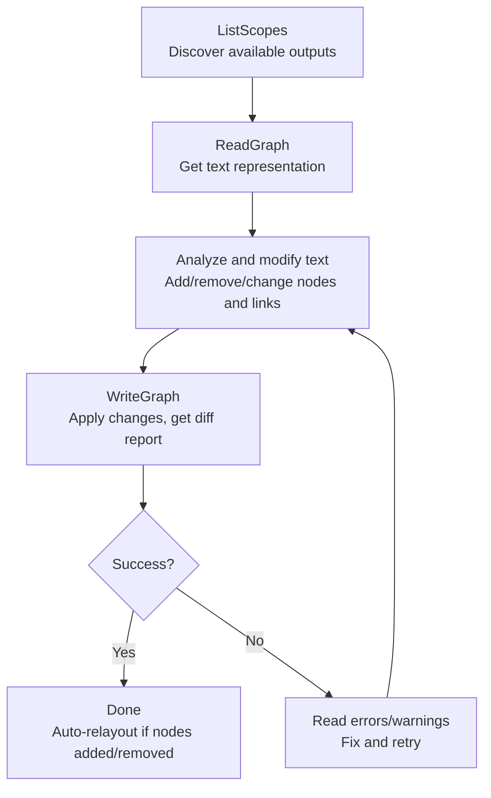

# Material Graph Text Bridge

Edit Unreal Engine material graphs through a compact text representation. This skill converts material node graphs into AI-friendly text, lets you modify it, then writes the changes back.

**Prerequisite**: The `unreal-client-protocol` skill must be available and the UE editor must be running with the UCP plugin enabled.

## Invocation

All operations go through UCP's `call` command, targeting the CDO of `UMaterialGraphLibrary`:

```
object: /Script/UnrealClientProtocolEditor.Default__MaterialGraphLibrary
```

Locate the UCP skill's `scripts/UCP.py` (from the sibling `unreal-client-protocol` skill directory) and use the file-based invocation method described there.

## API Reference

### ListScopes — Discover available scopes

```json
{
  "type": "call",
  "object": "/Script/UnrealClientProtocolEditor.Default__MaterialGraphLibrary",
  "function": "ListScopes",
  "params": { "AssetPath": "/Game/Materials/M_Example" }
}
```

Returns JSON with `scopes` array. Each scope is a material output pin name (e.g. `"BaseColor"`, `"Roughness"`) or a composite subgraph name (prefixed with `Composite:`).

### ReadGraph — Read material graph as text

```json
{
  "type": "call",
  "object": "/Script/UnrealClientProtocolEditor.Default__MaterialGraphLibrary",
  "function": "ReadGraph",
  "params": { "AssetPath": "/Game/Materials/M_Example", "ScopeName": "" }
}
```

- `ScopeName` empty: returns all nodes reachable from any material output.
- `ScopeName` = a material property name (e.g. `"BaseColor"`): only nodes feeding that output.
- `ScopeName` = `"Composite:MySubgraph"`: nodes inside that composite subgraph.

### WriteGraph — Apply text changes to material graph

```json
{
  "type": "call",
  "object": "/Script/UnrealClientProtocolEditor.Default__MaterialGraphLibrary",
  "function": "WriteGraph",
  "params": {
    "AssetPath": "/Game/Materials/M_Example",
    "ScopeName": "",
    "GraphText": "<the modified text>"
  }
}
```

Returns a JSON diff report showing what changed. Automatically relayouts if nodes were added or removed.

### Relayout — Force auto-layout

```json
{
  "type": "call",
  "object": "/Script/UnrealClientProtocolEditor.Default__MaterialGraphLibrary",
  "function": "Relayout",
  "params": { "AssetPath": "/Game/Materials/M_Example" }
}
```

## Text Format Specification

### Structure

```
=== scope: <ScopeName> ===

=== nodes ===
N<index> <ClassName> {Key:Value, Key:Value} #<guid>
N<index> <ClassName> #<guid>

=== links ===
N<from>[.OutputName] -> N<to>.<InputName>
N<from>[.OutputName] -> [MaterialOutputName]
```

### Nodes Section

Each line defines one material expression node:

```
N0 MaterialExpressionScalarParameter {ParameterName:"Roughness", DefaultValue:0.5} #8a7ace5a479c6936fe1f9d9834b64624
```

- `N<index>`: Local ID used only for referencing within this text. Indices start at 0.
- `<ClassName>`: The UE reflection class name (e.g. `MaterialExpressionScalarParameter`). **Always preserve this exactly as-is** when editing.
- `{...}`: Properties that differ from the class default object (CDO). Only non-default values appear. Omit the braces entirely if no properties differ.
- `#<guid>`: The 32-hex `MaterialExpressionGuid`. **Preserve this for existing nodes** — it is used to match nodes between read and write. **Omit for newly added nodes** — a new GUID will be generated automatically.

### Property Value Formats

| Type | Format | Example |
|------|--------|---------|
| FString / FName / FText | Quoted | `"MyParam"` |
| float / int / bool | Literal | `0.5`, `3`, `true` |
| FLinearColor | UE struct text | `(R=1.000000,G=0.500000,B=0.000000,A=1.000000)` |
| FVector | UE struct text | `(X=1.000000,Y=2.000000,Z=3.000000)` |
| Asset reference | Quoted path | `"/Game/Textures/T_Diffuse"` |
| Enum | Exported name | `SAMPLERTYPE_Color` |
| Other | UE ExportText format | as-is from ExportTextItem |

**IMPORTANT**: Do not modify the format of property values you don't understand. Copy them verbatim.

### Links Section

Each line defines one connection:

```
N0 -> N3.Alpha
N2.RGB -> N3.B
N3 -> [BaseColor]
```

- **Source**: `N<index>` for single-output nodes, `N<index>.<OutputName>` for multi-output (e.g. `.RGB`, `.R`, `.G`, `.B`, `.A`).
- **Target (expression input)**: `N<index>.<InputName>` — input name comes from `GetInputName()`.
- **Target (material output)**: `[<PropertyName>]` — for standard outputs like `[BaseColor]`, `[Roughness]`, `[Normal]`, `[EmissiveColor]`, etc.

## Workflow

### Standard editing workflow



### Step-by-step example: Add a roughness parameter

1. **Read** the current graph:

```json
{"type":"call","object":"/Script/UnrealClientProtocolEditor.Default__MaterialGraphLibrary","function":"ReadGraph","params":{"AssetPath":"/Game/Materials/M_Example","ScopeName":""}}
```

2. **Analyze** the returned text — suppose it looks like:

```
=== nodes ===
N0 MaterialExpressionVectorParameter {ParameterName:"BaseColor", DefaultValue:(R=1.000000,G=1.000000,B=1.000000,A=1.000000)} #aabb...
N1 MaterialExpressionTextureSample {Texture:"/Game/T_Diffuse"} #ccdd...

=== links ===
N0 -> [BaseColor]
```

3. **Modify** — add a scalar parameter for roughness:

```
=== nodes ===
N0 MaterialExpressionVectorParameter {ParameterName:"BaseColor", DefaultValue:(R=1.000000,G=1.000000,B=1.000000,A=1.000000)} #aabb...
N1 MaterialExpressionTextureSample {Texture:"/Game/T_Diffuse"} #ccdd...
N2 MaterialExpressionScalarParameter {ParameterName:"Roughness", DefaultValue:0.5}

=== links ===
N0 -> [BaseColor]
N2 -> [Roughness]
```

4. **Write** the modified text back via UCP `call` to `WriteGraph`.

### Step-by-step example: Radial gradient material (pure nodes)

Build a radial gradient from center using only standard nodes:

```
=== nodes ===
N0 MaterialExpressionTextureCoordinate
N1 MaterialExpressionConstant2Vector {R:0.5, G:0.5}
N2 MaterialExpressionSubtract
N3 MaterialExpressionDotProduct
N4 MaterialExpressionSquareRoot
N5 MaterialExpressionSaturate
N6 MaterialExpressionOneMinus
N7 MaterialExpressionLinearInterpolate
N8 MaterialExpressionConstant3Vector {Constant:(R=0.000000,G=0.000000,B=0.000000,A=1.000000)}
N9 MaterialExpressionConstant3Vector {Constant:(R=0.200000,G=0.600000,B=1.000000,A=1.000000)}

=== links ===
N0 -> N2.A
N1 -> N2.B
N2 -> N3.A
N2 -> N3.B
N3 -> N4.Input
N4 -> N5.Input
N5 -> N6.Input
N6 -> N7.Alpha
N8 -> N7.A
N9 -> N7.B
N7 -> [BaseColor]
```

This computes `1 - saturate(length(UV - 0.5))` to create a radial gradient, then lerps between black and blue.
```

## Common Material Expression Classes

| Class Name | Key Properties | Description |
|------------|---------------|-------------|
| MaterialExpressionScalarParameter | ParameterName, DefaultValue, Group | Scalar (float) parameter |
| MaterialExpressionVectorParameter | ParameterName, DefaultValue | Color/vector parameter |
| MaterialExpressionStaticBoolParameter | ParameterName, DefaultValue | Static bool parameter |
| MaterialExpressionTextureSample | Texture | Sample a texture |
| MaterialExpressionTextureObject | Texture | Texture object reference |
| MaterialExpressionConstant | R | Single float constant |
| MaterialExpressionConstant2Vector | R, G | 2-component constant |
| MaterialExpressionConstant3Vector | Constant | 3-component constant (FLinearColor) |
| MaterialExpressionConstant4Vector | Constant | 4-component constant (FLinearColor) |
| MaterialExpressionAdd | | A + B |
| MaterialExpressionSubtract | | A - B |
| MaterialExpressionMultiply | | A * B |
| MaterialExpressionDivide | | A / B |
| MaterialExpressionLinearInterpolate | | Lerp(A, B, Alpha) |
| MaterialExpressionClamp | | Clamp(Input, Min, Max) |
| MaterialExpressionOneMinus | | 1 - Input |
| MaterialExpressionPower | | Base ^ Exp |
| MaterialExpressionDotProduct | | Dot(A, B) |
| MaterialExpressionCrossProduct | | Cross(A, B) |
| MaterialExpressionNormalize | | Normalize(Input) |
| MaterialExpressionAppendVector | | Append A and B components |
| MaterialExpressionComponentMask | R, G, B, A | Swizzle/mask components |
| MaterialExpressionTextureCoordinate | CoordinateIndex, UTiling, VTiling | UV coordinates |
| MaterialExpressionTime | | Game time |
| MaterialExpressionWorldPosition | | World position |
| MaterialExpressionVertexNormalWS | | World-space vertex normal |
| MaterialExpressionCameraPositionWS | | Camera world position |
| MaterialExpressionFresnel | Exponent, BaseReflectFraction | Fresnel effect |
| MaterialExpressionSaturate | | Clamp 0-1 |
| MaterialExpressionSquareRoot | | sqrt(Input) |
| MaterialExpressionAbs | | abs(Input) |
| MaterialExpressionCeil | | ceil(Input) |
| MaterialExpressionFloor | | floor(Input) |
| MaterialExpressionFrac | | frac(Input) |
| MaterialExpressionIf | | A >= B ? A>B : A<B (pins: A, B, A>B, A==B, A<B) |
| MaterialExpressionSwitch | SwitchInputNames | Switch by value (dynamic cases) |
| MaterialExpressionSetMaterialAttributes | Attributes | Set material attributes by name |
| MaterialExpressionMaterialFunctionCall | MaterialFunction | Call a material function |
| MaterialExpressionCustom | Code, OutputType, InputNames | Custom HLSL (avoid if possible) |
| MaterialExpressionComposite | SubgraphName | Subgraph container |

### Special: MaterialExpressionCustom

Custom nodes have dynamic inputs. The `InputNames` property controls input pins:

```
N0 MaterialExpressionCustom {Code:"return Inputs[0].x * Scale;", OutputType:CMOT_Float1, InputNames:["UV","Scale"]}
```

- `InputNames:["UV","Scale"]` creates two input pins named "UV" and "Scale".
- If omitted, the node has one unnamed default input.
- In HLSL code, access inputs via `Inputs[0]`, `Inputs[1]`, etc.
- Connect to inputs by name: `N1 -> N0.UV`, `N2 -> N0.Scale`.
- For the default unnamed input, use `N1 -> N0` (no pin name).

**Note**: Prefer native nodes over Custom HLSL (see Key Rules).

### Special: MaterialExpressionSwitch

Switch nodes have two fixed inputs (`SwitchValue`, `Default`) plus dynamic case inputs. The `SwitchInputNames` property controls dynamic case pins:

```
N0 MaterialExpressionSwitch {SwitchInputNames:["Red","Green","Blue"]}
```

- Connect the switch value: `N1 -> N0.SwitchValue`
- Connect the default: `N2 -> N0.Default`
- Connect cases by name: `N3 -> N0.Red`, `N4 -> N0.Green`, `N5 -> N0.Blue`

### Special: MaterialExpressionSetMaterialAttributes

SetMaterialAttributes nodes have a dynamic set of attribute inputs. The `Attributes` property lists which material attributes are exposed as input pins:

```
N0 MaterialExpressionSetMaterialAttributes {Attributes:["BaseColor","Roughness","Normal"]}
```

- Input 0 is always `MaterialAttributes` (the input attribute bundle).
- Additional inputs match the listed attribute names.
- Connect: `N1 -> N0.MaterialAttributes`, `N2 -> N0.BaseColor`, `N3 -> N0.Roughness`

## Material Output Pins

Standard material outputs used in `[...]` link targets:

| Output | Description |
|--------|-------------|
| BaseColor | Surface base color (RGB) |
| Metallic | Metallic (0-1) |
| Specular | Specular (0-1) |
| Roughness | Roughness (0-1) |
| EmissiveColor | Emissive color (RGB, HDR) |
| Normal | Normal map |
| Opacity | Opacity for translucent |
| OpacityMask | Opacity mask for masked |
| WorldPositionOffset | Vertex offset |
| AmbientOcclusion | AO |
| Refraction | Refraction |
| Anisotropy | Anisotropy |
| Tangent | Tangent |
| SubsurfaceColor | SSS color |
| PixelDepthOffset | Pixel depth offset |
| ShadingModel | Per-pixel shading model |
| FrontMaterial | Substrate front material |
| Displacement | Displacement (UE 5.4+) |

## Key Rules

1. **Prefer native material nodes over Custom HLSL**. Always build effects using standard MaterialExpression nodes (math, texture, parameters, etc.). Only use `MaterialExpressionCustom` as a last resort when no node combination can achieve the desired result. This ensures better compatibility, previews, and maintainability.
2. **Preserve GUIDs** on existing nodes. Only omit `#guid` for newly created nodes.
3. **Preserve class names exactly**. Do not abbreviate or rename them.
4. **Preserve property value formats**. If you don't understand a value, copy it verbatim.
5. **Use ListScopes first** when you don't know the material's structure.
6. **ReadGraph before WriteGraph** — always read the current state before modifying.
7. **Batch with UCP** — you can batch ListScopes + ReadGraph in a single UCP batch call for efficiency.
8. **All operations support Undo** (Ctrl+Z in the UE editor).

## Error Handling

- **WriteGraph errors**: Check the `errors` array in the JSON response. Common issues:
  - Unknown expression class name (typo or missing plugin)
  - Failed to connect (wrong input/output pin name)
  - Property import failure (wrong value format)
- **Warnings**: Check the `warnings` array — non-fatal issues like unresolved links.
- **Re-read after write**: If unsure about the result, call ReadGraph again to verify.
