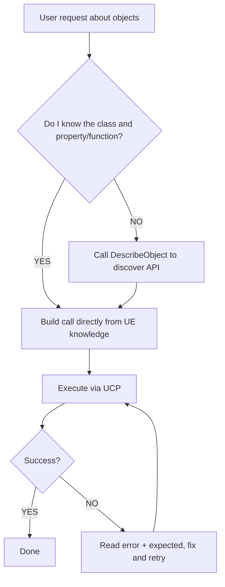

# Unreal Object Operations

Operate on UObjects through UCP's `call` command. This skill covers two function libraries and relevant engine APIs.

**Prerequisite**: The `unreal-client-protocol` skill must be available and the UE editor must be running with the UCP plugin enabled.

## Custom Function Libraries

### UObjectOperationLibrary (Runtime)

**CDO Path**: `/Script/UnrealClientProtocol.Default__ObjectOperationLibrary`

| Function | Params | Description |
|----------|--------|-------------|
| `GetObjectProperty` | `ObjectPath`, `PropertyName` | Read a UPROPERTY, returns JSON with property value |
| `SetObjectProperty` | `ObjectPath`, `PropertyName`, `JsonValue` | Write a UPROPERTY (supports Undo in editor). JsonValue is a JSON string. |
| `DescribeObject` | `ObjectPath` | Returns class info, all properties (with current values), and all functions |
| `DescribeObjectProperty` | `ObjectPath`, `PropertyName` | Returns detailed property metadata and current value |
| `DescribeObjectFunction` | `ObjectPath`, `FunctionName` | Returns full function signature with parameter types |
| `FindObjectInstances` | `ClassName`, `Limit` (default 100) | Find UObject instances by class path |
| `FindDerivedClasses` | `ClassName`, `bRecursive` (default true), `Limit` (default 500) | Find all subclasses of a class |

#### Examples

**Read a property:**
```json
{"type":"call","object":"/Script/UnrealClientProtocol.Default__ObjectOperationLibrary","function":"GetObjectProperty","params":{"ObjectPath":"/Game/Maps/Main.Main:PersistentLevel.StaticMeshActor_0.StaticMeshComponent0","PropertyName":"RelativeLocation"}}
```

**Write a property:**
```json
{"type":"call","object":"/Script/UnrealClientProtocol.Default__ObjectOperationLibrary","function":"SetObjectProperty","params":{"ObjectPath":"/Game/Maps/Main.Main:PersistentLevel.StaticMeshActor_0.StaticMeshComponent0","PropertyName":"RelativeLocation","JsonValue":"{\"X\":100,\"Y\":200,\"Z\":0}"}}
```

**Find instances:**
```json
{"type":"call","object":"/Script/UnrealClientProtocol.Default__ObjectOperationLibrary","function":"FindObjectInstances","params":{"ClassName":"/Script/Engine.StaticMeshActor","Limit":50}}
```

**Describe an unfamiliar object:**
```json
{"type":"call","object":"/Script/UnrealClientProtocol.Default__ObjectOperationLibrary","function":"DescribeObject","params":{"ObjectPath":"/Game/Maps/Main.Main:PersistentLevel.BP_CustomActor_C_0"}}
```

### UObjectEditorOperationLibrary (Editor)

**CDO Path**: `/Script/UnrealClientProtocolEditor.Default__ObjectEditorOperationLibrary`

| Function | Params | Description |
|----------|--------|-------------|
| `UndoTransaction` | (none) | Undo the last editor transaction |
| `RedoTransaction` | (none) | Redo the last undone transaction |
| `GetTransactionState` | (none) | Returns undo/redo stack state: canUndo, canRedo, undoTitle, redoTitle, undoCount, queueLength |

#### Example

```json
[
  {"type":"call","object":"/Script/UnrealClientProtocolEditor.Default__ObjectEditorOperationLibrary","function":"GetTransactionState"},
  {"type":"call","object":"/Script/UnrealClientProtocolEditor.Default__ObjectEditorOperationLibrary","function":"UndoTransaction"}
]
```

## Engine Built-in Function Libraries

You can also call these engine-provided libraries via UCP `call`:

### UKismetSystemLibrary

**CDO Path**: `/Script/Engine.Default__KismetSystemLibrary`

Commonly used functions:
- `PrintString(InString, bPrintToScreen, bPrintToLog, TextColor, Duration)` — Print debug text
- `GetDisplayName(Object)` — Get display name
- `GetObjectName(Object)` — Get object name
- `GetPathName(Object)` — Get full path name
- `IsValid(Object)` — Check if object is valid
- `GetClassDisplayName(Class)` — Get class display name

### UKismetMathLibrary

**CDO Path**: `/Script/Engine.Default__KismetMathLibrary`

Math utilities: vector operations, rotator operations, transforms, random, etc.

## Property Value Formats

When using `SetObjectProperty`, the `JsonValue` parameter is a JSON string:
- `FVector` → `"{\"X\":1,\"Y\":2,\"Z\":3}"`
- `FRotator` → `"{\"Pitch\":0,\"Yaw\":90,\"Roll\":0}"`
- `FLinearColor` → `"{\"R\":1,\"G\":0.5,\"B\":0,\"A\":1}"`
- `FString` → `"\"hello\""`
- `bool` → `"true"` / `"false"`
- `float/int` → `"1.5"` / `"42"`
- `UObject*` → `"\"/Game/Path/To/Asset.Asset\""`

## Decision Flow


